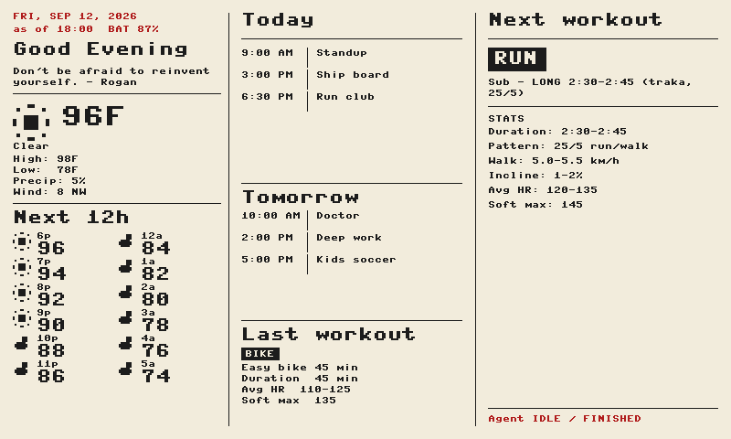

# Pico 2 W + Waveshare 7.5" e-Paper (B) desk dashboard

Wi‑Fi fetch → draw e-ink → **deepsleep** → wake → repeat.  
Timezone: **America/Phoenix** (UTC−7, no DST).  
Draws **3×/day** at **06:00 / 12:00 / 18:00**.



License: [MIT](LICENSE) — Copyright (c) 2026 Tom Santek.  
Waveshare e-Paper driver code retains its original MIT notice.

## Hardware

```
UPS (LiPo) → RTC (DS3231 + coin cell) → e-Paper 7.5" B → Pico 2 W
```

| Battery | Role |
|---------|------|
| **UPS LiPo** | Powers (and wakes) the Pico + screen. Keep UPS **ON**. |
| **RTC CR2032** | Backs up DS3231 time if UPS power is gone. Not a wake/run battery. |

With Waveshare **R5** soldered (RTC **INT → GP3**), firmware arms **Alarm1** for the next `DRAW_HOURS` slot. Actual wake is mostly timed `deepsleep` naps (Pico max ~70 min; GPIO wake from deepsleep is unreliable on Pico 2 W). The coin cell does not power those wakes.

Optional: wall USB into the **UPS** charge port so the pack stays topped up.

## Quick start

```bash
# Host tools (once)
python3 -m venv .venv
source .venv/bin/activate
pip install -r requirements.txt   # mpremote

# Secrets (once)
cp firmware/secrets.example.py firmware/secrets.py
# edit Wi‑Fi, ICAL_URLS, Cursor API key, agent id

# Deploy
./run_pico.sh main
```

Quit **Thonny** first (it locks the serial port).

After the panel draws, unplug laptop USB during the countdown so the board can deepsleep on UPS.

## Day-to-day commands

| Command | What it does |
|---------|----------------|
| `./run_pico.sh main` | **Copy `firmware/` + run dashboard** (normal update) |
| `./run_pico.sh --upload-only` | Copy firmware only |
| `./run_pico.sh set_rtc` | Set DS3231 from Mac Phoenix time |
| `./run_pico.sh rtc_check` | Read RTC / OSF |
| `./run_pico.sh demo_offline` | Layout preview (no Wi‑Fi) |
| `./run_pico.sh agent_dump` | Dump Cursor agent runs |
| `./recover_pico.sh` | Wipe flash + reinstall MicroPython (see below) |

Force a serial port if probing picks the wrong device:

```bash
MPREMOTE_PORT=/dev/cu.usbmodemXXXX ./run_pico.sh main
ls /dev/cu.usbmodem*
```

## If `./run_pico.sh` can’t connect

Deepsleep turns off USB serial. Ghost ports like `cu.usbmodem3` are **not** the Pico.

1. Plug laptop USB into the **Pico**  
2. Press **RESET** (do **not** hold BOOTSEL)  
3. Within a few seconds: `./run_pico.sh main`  

`boot.py` waits **5 seconds** on boot so mpremote can attach.

### Full recovery (no REPL / always sleeps)

1. Hold **BOOTSEL**, plug USB (or BOOTSEL + RESET) until Finder shows **RP2350**  
2. `./recover_pico.sh` — nukes filesystem, flashes MicroPython  
3. `./run_pico.sh main`  

## What the dashboard shows

| Left | Center | Right |
|------|--------|-------|
| Date, greeting, weather | Today + tomorrow calendar, last workout | Next workout (Cursor agent) |

Footer: UPS battery % and `as of HH:MM`.

## Secrets (`firmware/secrets.py`)

| Setting | Meaning |
|---------|---------|
| `DRAW_HOURS = (6, 12, 18)` | Phoenix draw times |
| `ENABLE_DEEPSLEEP = True` | Sleep between draws |
| `USE_RTC_ALARM = True` | Arm DS3231 Alarm1 (GP3 / Waveshare R5) |
| `SKIP_SLEEP_WHEN_USB = True` | Stay awake after draw while laptop USB is plugged |
| `ICAL_URLS = (...)` | One or more Google secret iCal URLs |
| `ICAL_CACHE_DAY = True` | One calendar download per Phoenix day |
| `WEATHER_CACHE_DAY = True` | One weather download per Phoenix day |
| `AGENT_PROMPT_ON_REFRESH` | `True` = POST status prompt each draw; `False` = read only |
| `AGENT_POLL_TIMEOUT` | Max seconds to wait on agent (keep ~90 on UPS) |

## Power / sleep behavior

- Between draws the Pico takes **~70 min deepsleep naps** (chip limit), then checks the RTC.  
- **Full redraw only** inside the draw windows (06/12/18 ± 5 min). Mid-naps do **no Wi‑Fi / no panel update**.  
- Laptop USB connected → full draw allowed (deploy mode); unplug on countdown for desk/UPS mode.

## Cursor agent

With `AGENT_PROMPT_ON_REFRESH = True`, each draw:

1. POST a status run to the agent  
2. Poll until finished  
3. Parse `## NEXT` / `## LAST` into workout cards  

Set `AGENT_PROMPT_ON_REFRESH = False` to skip the cloud run (faster, less battery).

## Bring-up / hardware checks

Low-level I2C / e-paper checks: [`bringup/`](bringup/).

## Notes

- SoftI2C: RTC GP20/21, UPS INA219 GP6/7 `@ 0x43`  
- E-ink full refresh flickers ~15–25s  
- Calendar ICS feeds can be large; day-cache avoids re-download at noon/evening  
- Workout kinds: `RUN` / `GYM` / `BIKE` / `SWIM`  
- Regenerate the README preview: `python3 tools/render_preview.py`  
